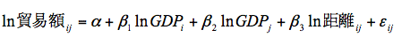

# Gravity Model(グラビティモデル)
地域間の相互作用を分析・予測・記述するために用いられる仮設。ニュートンの万有引力の法則を応用したもので、「2国間の貿易量は両国の経済規模に比例し、距離に反比例する」など。交通量の予測や人口移動など様々な分野で用いられる。

国際経済学での貿易における重力モデルでは、２国間(i,j)の貿易のための基本的なモデルは次の形を取る。

国際貿易の分野でっ実証的に大変成功した式であると言われている。

## グラビティモデルとは
重力モデルでは、貿易額は経済規模(GDP)の大きい国通しでは大きくなる一方、互いの距離が遠いと小さくなると考える。これは天体と天体の引力が天体の重量に比例し、天体の距離に反比例していることに似ている。つまり、次のような関係が成り立つと考える。

ここで、貿易国ijは国iから、国jへの輸出額や輸入額である。GDPiは国iの経済規模、GDPjは国jの経済規模である。Aは定数。距離ijは国iから国jへの距離である。伝統的には、対数線形化した以下の式を最小二乗法で推定する。

ここでεijは誤差項である。

## グラビティモデルを用いた研究
- グラビティモデルによるアメリカの航空輸送流動量の分析
  - http://www.eco.nihon-u.ac.jp/center/economic/publication/journal/pdf/38/38ijiri.pdf
- 将来交通量予測モデル - 帯広市
  - http://www.city.obihiro.hokkaido.jp/toshikensetsubu/toshikeikakuka/d070511_2_2.data/05shou.pdf

## 参考サイト
- 国際貿易と貿易政策研究メモ 第13回「重力方程式」
  - https://www.rieti.go.jp/users/tanaka-ayumu/serial/013.html
- 国際貿易と貿易政策研究メモ 第14回「重力方程式の理論と新しい推定方法」
  - https://www.rieti.go.jp/users/tanaka-ayumu/serial/014.html